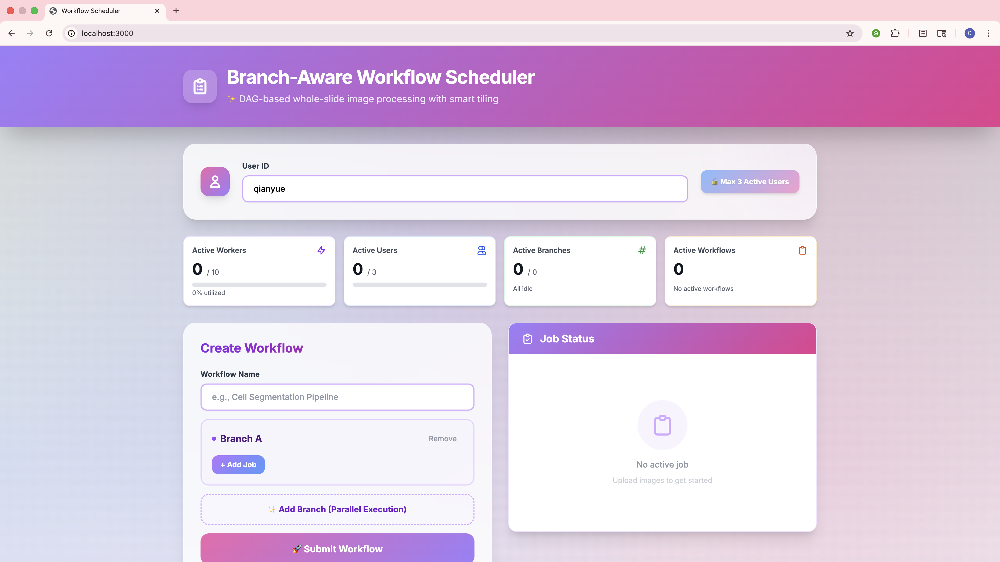

# Branch-Aware Workflow Scheduler

A full-stack DAG-based workflow scheduler for whole-slide image (WSI) processing with **InstanSeg integration**, **smart tiling optimization**, **branch-aware execution**, and **multi-tenant isolation**.

---

## Core Features

### 1️. Branch-Aware Scheduling
- Jobs within the same `branch` execute **serially** (FIFO order)
- Jobs from different branches run **in parallel** (up to global worker limit)
- Branch-local failure handling - one branch's failure doesn't block others

### 2️. Multi-Tenant Isolation & Active-User Limit
- Maximum **3 concurrent active users** (4th user queued until slot available)
- Each user sees only their own workflows via `X-User-ID` header
- User-specific file storage and job tracking

### 3️. Smart Tiling with InstanSeg
- **Tissue detection** at thumbnail level skips 60-70% of background tiles
- **Overlapping tiles** with Gaussian blending prevents seam artifacts
- **Batch GPU processing** of 16 tiles simultaneously
- Processes gigapixel whole-slide images efficiently

### 4️. Real-Time Progress Tracking
- Per-workflow progress monitoring
- Per-job and per-tile granularity
- Live updates via polling (WebSocket-ready architecture)

---

## Architecture Overview

```
┌───────────────────────────────────────────────────────────┐
│                        Frontend                           │
│  ┌──────────────┐  ┌──────────────┐  ┌──────────────┐     │
│  │ DAG Builder  │  │ Live Progress│  │  Scheduler   │     │
│  │  (JSON)      │  │   Dashboard  │  │    Stats     │     │
│  └──────────────┘  └──────────────┘  └──────────────┘     │
└───────────────────────────────────────────────────────────┘
                              │
                              ▼
┌────────────────────────────────────────────────────────────┐
│                    FastAPI Backend                         │
│  ┌──────────────────────────────────────────────────────┐  │
│  │         Branch-Aware Scheduler                       │  │
│  │  - DAG parsing & topological sort                    │  │
│  │  - Branch isolation (serial within, parallel across) │  │
│  │  - Multi-tenant queue (max 3 active users)           │  │
│  └──────────────────────────────────────────────────────┘  │
│                              │                             │
│                              ▼                             │
│  ┌──────────────────────────────────────────────────────┐  │
│  │           Job Execution Engine                       │  │
│  │  - InstanSeg integration (segmentation)              │  │
│  │  - Smart tiling (tissue detection + overlap)         │  │
│  │  - Batch GPU processing                              │  │
│  │  - Progress tracking (tiles completed/total)         │  │
│  └──────────────────────────────────────────────────────┘  │
└────────────────────────────────────────────────────────────┘
                              │
                              ▼
┌───────────────────────────────────────────────────────────┐
│                     State Management                      │
│  ┌──────────┐  ┌──────────┐  ┌──────────┐                 │
│  │  Redis   │  │In-Memory │  │  Local   │                 │
│  │  (Queue  │  │(Metadata)│  │  Files   │                 │
│  │  + Locks)│  │          │  │(Results) │                 │
│  └──────────┘  └──────────┘  └──────────┘                 │
└───────────────────────────────────────────────────────────┘
```

### Technology Stack

**Frontend:**
- Next.js 14 (App Router)
- TypeScript
- Tailwind CSS
- Axios (HTTP client)

**Backend:**
- FastAPI (Python web framework)
- Celery (Distributed task queue)
- Redis (Message broker & result backend)
- OpenSlide (Whole-slide image reading)
- InstanSeg (Cell segmentation - placeholder implementation)
- NetworkX (DAG operations)
- NumPy, OpenCV, scikit-image (Image processing)

---

## Project Structure

```
branch-aware-multi-tenant-workflow-scheduler/
│
├── workflow-backend/                  # Backend service
│   ├── app/
│   │   ├── __init__.py                # Package initializer
│   │   ├── main.py                    # FastAPI application
│   │   ├── celery_app.py              # Celery configuration
│   │   │
│   │   ├── scheduler/
│   │   │   ├── __init__.py
│   │   │   └── branch_scheduler.py    # Branch-aware DAG scheduler
│   │   │
│   │   ├── workers/
│   │   │   ├── __init__.py
│   │   │   ├── segment_worker.py      # InstanSeg processing
│   │   │   └── smart_tiling.py        # Smart tiling logic
│   │   │
│   │   ├── models/                    # Pydantic models (optional)
│   │   └── utils/                     # Utilities (optional)
│   │
│   ├── uploads/                       # User-uploaded files (gitignored)
│   ├── venv/                          # Python virtual environment (gitignored)
│   ├── requirements.txt               # Python dependencies
│   └── test_system.py                 # Quick test script
│
└── workflow-frontend/                 # Frontend application
    ├── app/
    │   ├── components/
    │   │   ├── WorkflowSubmit.tsx     # Workflow submission form
    │   │   ├── WorkflowStatus.tsx     # Status tracking component
    │   │   └── SchedulerStats.tsx     # Scheduler statistics
    │   ├── layout.tsx                 # Root layout
    │   ├── page.tsx                   # Main page
    │   └── globals.css                # Global styles
    │
    ├── next.config.js                 # Next.js configuration
    ├── package.json                   # Node dependencies
    ├── tsconfig.json                  # TypeScript configuration
    └── tailwind.config.js             # Tailwind configuration
```

---

## Getting Started

### Prerequisites

- **Python 3.11 or 3.10** (Required for InstanSeg compatibility - Python 3.12+ not supported)
  - Check: `python3.11 --version` or `python3.10 --version`
  - Install on macOS: `brew install python@3.11`
  - Install on Linux: `apt-get install python3.11`
- **Node.js 18+** (Check: `node --version`)
- **Redis** (Install: `brew install redis` on macOS, usually pre-installed on Linux)
- **Git**

**Important:** InstanSeg requires Python < 3.12 due to dependency constraints. The start script will automatically use Python 3.11 or 3.10 if available.

### Quick Installation (Recommended)

The easiest way to set up and run the entire system:

```bash
# Clone the repository
git clone https://github.com/dingqianyue/branch-aware-multi-tenant-workflow-scheduler.git
cd branch-aware-multi-tenant-workflow-scheduler

# Run the start script (handles everything automatically)
./start.sh
```

The `start.sh` script will:
1. ✓ Check for Python 3.11/3.10 (auto-selects compatible version)
2. ✓ Check for Node.js and Redis
3. ✓ Create virtual environment with correct Python version
4. ✓ Install all backend dependencies (FastAPI, Celery, InstanSeg, etc.)
5. ✓ Install frontend dependencies (Next.js, React, etc.)
6. ✓ Start Redis automatically
7. ✓ Launch Celery worker, FastAPI backend, and Next.js frontend
8. ✓ Display service URLs and log locations

**Expected Output:**
```
════════════════════════════════════════
  All Services Running!
════════════════════════════════════════

🚀 Workflow Scheduler is ready!

Services:
  • Celery Worker:  PID 12345
  • FastAPI:        PID 12346 (http://localhost:8000)
  • Frontend:       PID 12347 (http://localhost:3000)

URLs:
  • Frontend:       http://localhost:3000
  • API Docs:       http://localhost:8000/docs
  • API Stats:      http://localhost:8000/scheduler/stats
```

Press `Ctrl+C` to stop all services.

---

### Manual Installation (For Development)

If you prefer manual control or are troubleshooting:

#### 1. Clone Repository
```bash
git clone https://github.com/dingqianyue/branch-aware-multi-tenant-workflow-scheduler.git
cd branch-aware-multi-tenant-workflow-scheduler
```

#### 2. Install Python 3.11
```bash
# macOS
brew install python@3.11

# Linux (Ubuntu/Debian)
sudo apt-get update
sudo apt-get install python3.11 python3.11-venv
```

#### 3. Backend Setup
```bash
cd workflow-backend

# Create virtual environment with Python 3.11
/usr/local/bin/python3.11 -m venv venv  # macOS
# OR
/usr/bin/python3.11 -m venv venv        # Linux

# Activate virtual environment
source venv/bin/activate

# Install dependencies with numpy compatibility fix
pip install "numpy>=1.26.4,<2.0"
pip install fastapi uvicorn celery redis openslide-python \
            networkx opencv-python-headless scikit-image pillow \
            websockets python-multipart aiofiles requests torch torchvision

# Install InstanSeg
pip install git+https://github.com/instanseg/instanseg.git
```

**Notes:**
- We install `numpy>=1.26.4,<2.0` first to avoid conflicts between InstanSeg (requires numpy < 2.0) and opencv-python-headless (prefers numpy >= 2.0).
- `requests` is required for InstanSeg to download pretrained model files.

#### 4. Frontend Setup
```bash
cd ../workflow-frontend
npm install
```

#### 5. Start Redis
```bash
# macOS
brew services start redis

# Linux
sudo systemctl start redis
# OR
redis-server --daemonize yes
```

---

## Understanding the System

### Branch-Aware Execution

**Example Workflow:**
```json
{
  "branch_A": ["job1", "job2", "job3"],  // Sequential
  "branch_B": ["job4", "job5"]           // Sequential, parallel to A
}
```

**Execution Timeline:**
```
Time  Branch_A    Branch_B
0s    job1        job4
3s    job2        job5
6s    job3        (idle)
```

- Jobs 1 and 4 run simultaneously (different branches)
- Job 2 waits for job 1 to finish (same branch)
- Maximum parallelism: Number of branches (up to worker limit)

### Smart Tiling Optimization

**Traditional Approach:**
- Process all tiles: 500 tiles × 5s = **2,500 seconds (42 minutes)**

**Smart Tiling:**
1. **Tissue Detection**: Thumbnail analysis (< 1 second)
2. **Selective Processing**: Only 180 tissue tiles × 5s = 900s
3. **Speedup**: **60-70% reduction** → **15 minutes total**

**How It Works:**
```python
# 1. Load WSI at low resolution
thumbnail = wsi.get_thumbnail((2000, 2000))

# 2. Detect tissue (Otsu thresholding)
tissue_mask = gray < threshold_otsu(gray)

# 3. Generate tiles only where tissue exists
for tile in all_possible_tiles:
    if has_tissue(tile):
        process(tile)  # Only 30-40% of tiles!
```

---

## API Documentation

### Workflows

#### `POST /workflows`
Submit a workflow with multiple jobs organized in branches

**Headers:**
- `X-User-ID`: string (required) - User identifier

**Request Body:**
```json
{
  "name": "Cell Segmentation Pipeline",
  "dag": {
    "branch_A": [
      {"job_id": "job1", "image": "image1.svs", "type": "segment"},
      {"job_id": "job2", "image": "image2.svs", "type": "segment"}
    ],
    "branch_B": [
      {"job_id": "job3", "image": "image3.svs", "type": "segment"}
    ]
  }
}
```

**Response:**
```json
{
  "status": "ACCEPTED",
  "workflow_id": "uuid",
  "branches": ["branch_A", "branch_B"],
  "total_jobs": 3,
  "message": "Workflow accepted with 3 jobs"
}
```

**Or if queued:**
```json
{
  "status": "QUEUED",
  "workflow_id": "uuid",
  "queue_position": 2,
  "message": "Waiting for available slot"
}
```

---

#### `GET /workflows/{workflow_id}`
Get workflow status with progress

**Headers:**
- `X-User-ID`: string (required)

**Response:**
```json
{
  "workflow_id": "uuid",
  "name": "Cell Segmentation Pipeline",
  "status": "RUNNING",
  "progress": 45,
  "jobs_total": 4,
  "jobs_completed": 1,
  "jobs_running": 2,
  "jobs_queued": 1,
  "branches": ["branch_A", "branch_B"]
}
```

---

#### `GET /scheduler/stats`
Get overall scheduler statistics

**Response:**
```json
{
  "active_workers": 3,
  "max_workers": 10,
  "active_users": 2,
  "max_active_users": 3,
  "queued_users": 1,
  "branches_active": 2,
  "total_branches": 5,
  "workflows_active": 2
}
```

---

## Scaling for 10× More Jobs/Users

### Current Capacity (Single Machine)
- **3 active users** simultaneously
- **10 concurrent workers** (adjustable)
- **Handles ~100 jobs/hour** (depends on WSI size)

### Short-Term Optimizations (100-1000 jobs/hour)

**1. Database Migration**
```python
# Replace in-memory storage
jobs_db = {}  # Current

# With persistent database
from sqlalchemy import create_engine
engine = create_engine('postgresql://localhost/workflows')
```

**2. Horizontal Worker Scaling**
```bash
# Deploy 10 worker instances
docker-compose scale worker=10

# Or Kubernetes
kubectl scale deployment celery-worker --replicas=10
```

**3. Redis Cluster**
```yaml
# docker-compose.yml
redis-sentinel-1:
  image: redis:alpine
redis-sentinel-2:
  image: redis:alpine
redis-sentinel-3:
  image: redis:alpine
```

**4. File Storage Migration**
```python
# Move from local storage
UPLOAD_DIR = Path("uploads")

# To S3/MinIO
import boto3
s3 = boto3.client('s3')
s3.upload_file('local.svs', 'bucket', 'user/workflow/file.svs')
```

### Medium-Term (1,000-10,000 jobs/hour)

**5. Load Balancing**
```nginx
upstream fastapi {
    server api1:8000;
    server api2:8000;
    server api3:8000;
}
```

**6. Caching Strategy**
```python
# Cache tissue masks
@lru_cache(maxsize=1000)
def get_tissue_mask(wsi_path):
    return compute_tissue_mask(wsi_path)

# Cache in Redis
redis.setex(f"mask:{wsi_path}", 3600, mask_data)
```

**7. GPU Acceleration**
```python
# Batch processing on GPU
with torch.cuda.device(0):
    masks = model.predict_batch(tiles, batch_size=32)
```

### Long-Term (10,000+ jobs/hour)

**8. Microservices Architecture**
```
API Service → Job Scheduler → Worker Pool
    ↓              ↓              ↓
  Users      Work Queue     GPU Cluster
```

**9. Kubernetes Auto-Scaling**
```yaml
apiVersion: autoscaling/v2
kind: HorizontalPodAutoscaler
spec:
  minReplicas: 5
  maxReplicas: 50
  metrics:
  - type: Resource
    resource:
      name: cpu
      targetAverageUtilization: 70
```

**10. Distributed File System**
```bash
# GlusterFS for shared storage across nodes
gluster volume create workflows replica 3 \
  server1:/data server2:/data server3:/data
```

---

## Troubleshooting

### Backend Issues

**Issue: "Python 3.11 or 3.10 not found"**
```bash
# macOS - Install Python 3.11 via Homebrew
brew install python@3.11
# Verify installation
/opt/homebrew/bin/python3.11 --version

# Linux - Install Python 3.11 via apt
sudo apt-get update
sudo apt-get install python3.11 python3.11-venv
# Verify installation
/usr/bin/python3.11 --version
```

**Issue: "numpy version conflict" or "opencv requires numpy>=2"**
```bash
# The start script now handles this automatically by installing numpy<2 first
# If you encounter this manually, install in this order:
pip install "numpy>=1.26.4,<2.0"
pip install opencv-python-headless
pip install git+https://github.com/instanseg/instanseg.git
```

**Explanation:** InstanSeg requires numpy < 2.0, but opencv-python-headless prefers numpy >= 2.0. We pin numpy to 1.26.4 for compatibility with both.

**Issue: "ModuleNotFoundError: No module named 'openslide'"**
```bash
# Install system library first
brew install openslide  # macOS
sudo apt install openslide-tools  # Linux

# Then Python package (already included in start.sh)
pip install openslide-python
```

**Issue: "Unable to load celery application"**
```bash
# Check files exist
ls app/scheduler/branch_scheduler.py
ls app/workers/segment_worker.py

# Verify __init__.py files
touch app/__init__.py app/scheduler/__init__.py app/workers/__init__.py
```

**Issue: "Redis connection refused"**
```bash
# Check Redis is running
redis-cli ping  # Should return PONG

# Start Redis
brew services start redis  # Mac
sudo service redis start   # Linux
```

## Demo Screenshot

